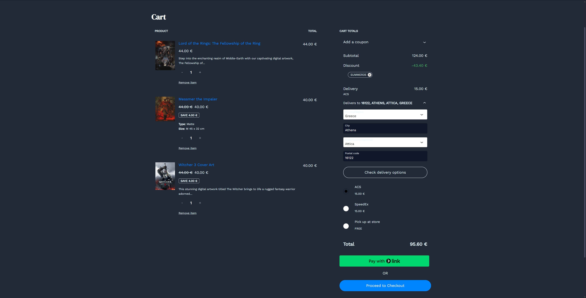
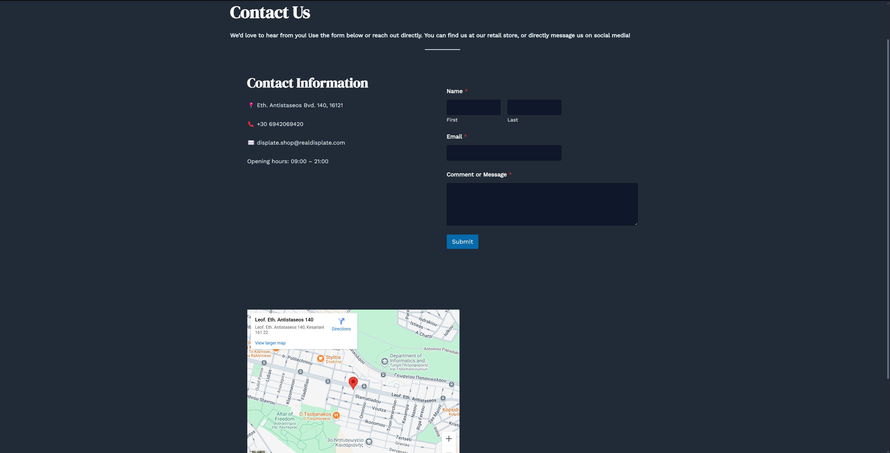
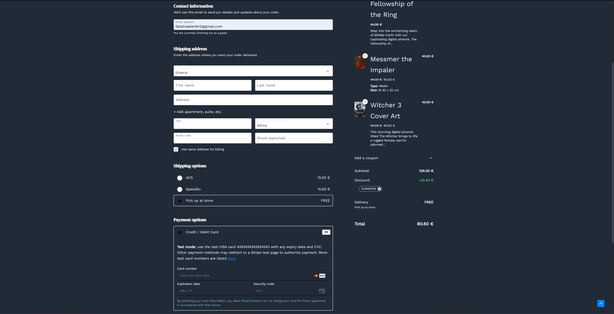

🔒 This project is unlicensed and intended for educational purposes only.

# 🖼️ Displate-Inspired WordPress E-shop

A fan-made, locally hosted e-commerce website built using WordPress and WooCommerce, inspired by the concept of Displate but fully customized with a unique design and layout.

---

## 🚀 Features

This project includes the core functionality of a modern e-shop, such as:

- ✅ Product filtering and categorization
- 🛍️ Variable products (different sizes and styles)
- 💳 Multiple payment methods (locally configured)
- 🌍 Support for different shipping zones, methods, and costs
- 🎟️ Discount coupon code functionality
- 🔖 On-sale product badges and display
- 📬 Contact form (via WPForms)
- 🧩 Custom design using Astra theme
- ⚙️ Booster plugins to enhance WooCommerce features

---

## 🛠️ Technologies Used

- **WordPress** (locally hosted via XAMPP)
- **WooCommerce** for e-commerce functionality
- **Astra Theme** with extensive customization
- **Elementor** for layout and page building
- **Custom CSS** tweaks for visual polish
- **Additional Plugins**:
  - *WPForms* (contact form)
  - *Booster for WooCommerce*
  - *Viva Wallet Payment Gateway* (configured for testing)

---

## 📦 Installation Instructions

This project is a locally hosted WordPress e-shop built with WooCommerce. To set it up:

1. **Install XAMPP** (or another local web server with PHP and MySQL support).
2. Clone or download this repository into your htdocs directory.
3. Create a new MySQL database (e.g., wordpress_displate) via phpMyAdmin.
4. Import the provided database dump file.
5. Edit wp-config.php to match your local database credentials:
   ```
      define('DB_NAME', 'wordpress_displate');
      define('DB_USER', 'root');
      define('DB_PASSWORD', '');
      define('DB_HOST', 'localhost');
6. Start Apache and MySQL from your XAMPP control panel.
7. Visit http://localhost/your-project-folder in your browser.

⚠️ If the site appears blank or broken, ensure that all theme and plugin folders are in the correct location under wp-content/ .

⚠️ The images used in this website (shown in the screenshots) are not included in the repository.

⚠️ You need an existing installation of the WordPress environment to implement this project. If you don't have one, after installing XAMPP (or another local web server) download and install WordPress.

---

## 📸 Screenshots

<p align="center"><strong>Homepage</strong></p>


<p align="center"><strong>Shop</strong></p>


<p align="center"><strong>Cart</strong></p>



<p align="center"><strong>Contact Page</strong></p>



<p align="center"><strong>Checkout</strong></p>


